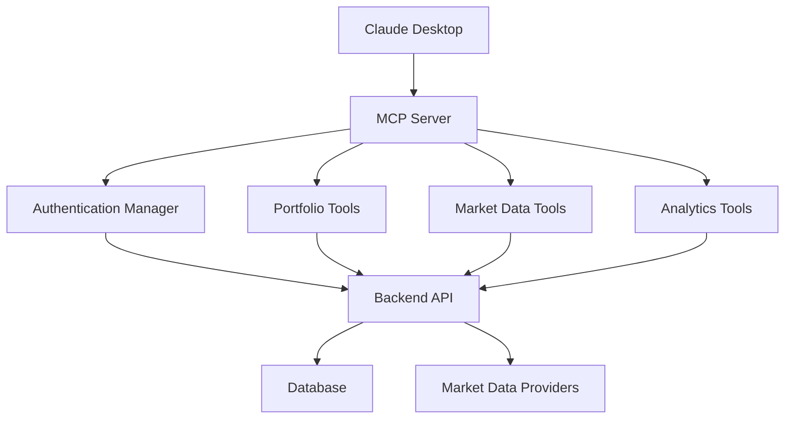

# Financial Dashboard MCP Server

## Overview

The Financial Dashboard MCP (Model Context Protocol) Server provides AI-powered financial analysis tools that integrate with Claude Desktop. It offers comprehensive portfolio management, market data analysis, and investment recommendations through a secure, authenticated interface.

## Features

### 🔒 Security Features

- **Dynamic Authentication**: Secure JWT-based authentication with automatic token refresh
- **User-specific Data**: All operations are tied to authenticated user accounts
- **Secure API Calls**: All backend communication uses proper authentication headers
- **Environment-based Configuration**: No hardcoded credentials or tokens

### 📊 Portfolio Management Tools

- `get_positions` - Retrieve current portfolio positions with real-time data
- `get_portfolio_summary` - Comprehensive portfolio overview with performance metrics
- `get_allocation` - Asset allocation breakdown by type and percentage
- `add_position` - Add new investments to the portfolio
- `update_position` - Modify existing portfolio positions

### 📈 Market Data & Analysis

- `get_asset_price` - Real-time asset prices and market data
- `calculate_performance` - Portfolio performance across different time periods
- `analyze_portfolio_risk` - Risk metrics, diversification analysis, and volatility assessment
- `get_market_trends` - Current market trends and sector performance

### 🤖 AI-Powered Analytics

- `recommend_allocation` - Personalized allocation recommendations based on risk tolerance
- `analyze_opportunity` - Investment opportunities based on criteria and market conditions
- `rebalance_portfolio` - Smart rebalancing recommendations with tax considerations
- `generate_insights` - Comprehensive AI-driven portfolio insights and recommendations

## Architecture



## Installation & Setup

### Prerequisites

1. **Financial Dashboard Backend Running**

   ```bash
   cd /path/to/financial-dashboard-mcp
   ./scripts/start_dashboard.sh
   ```

2. **Demo User Created**

   ```bash
   python scripts/create_demo_user.py
   ```

### MCP Server Configuration

1. **Test the MCP Server**

   ```bash
   python scripts/test_mcp_server.py
   ```

2. **Configure Claude Desktop**

   **macOS:** `~/Library/Application Support/Claude/claude_desktop_config.json`
   **Windows:** `%APPDATA%\\Claude\\claude_desktop_config.json`

   ```json
   {
     "mcpServers": {
       "financial-dashboard": {
         "command": "python",
         "args": [
           "/full/path/to/financial-dashboard-mcp/mcp_server/__main__.py"
         ],
         "env": {
           "BACKEND_URL": "http://localhost:8000",
           "DEMO_USERNAME": "demo",
           "DEMO_PASSWORD": "demo123"
         }
       }
     }
   }
   ```

3. **Restart Claude Desktop** to load the MCP server

## Usage Examples

### Portfolio Queries

```
"Show me my current portfolio positions"
"What's my portfolio summary including performance?"
"How is my portfolio allocated across different asset types?"
```

### Market Analysis

```
"Get the current price of Apple stock"
"Calculate my portfolio performance for the last year"
"Analyze the risk level of my current portfolio"
"What are the current market trends?"
```

### AI Recommendations

```
"Recommend an allocation for moderate risk tolerance with a long-term horizon"
"Find growth stock opportunities for my portfolio"
"Should I rebalance my portfolio? Show me the recommendations"
"Generate comprehensive insights about my investment strategy"
```

### Portfolio Management

```
"Add 100 shares of Microsoft at $380 per share"
"Update position ID 5 with 150 shares"
"Show me opportunities in the technology sector"
```

## Authentication System

The MCP server uses a sophisticated authentication system:

### Dynamic Token Management

- Automatically authenticates with the backend using demo credentials
- Refreshes tokens when they expire
- Falls back to demo mode (user_id=3) if authentication fails
- Maintains separate user sessions for multi-user support

### Security Features

- No hardcoded tokens or credentials in the codebase
- All API calls include proper authentication headers
- User-specific data access and permissions
- Secure credential management through environment variables

## Tool Categories

### Portfolio Tools (`mcp_server/tools/portfolio.py`)

Focus on portfolio management and position tracking

### Market Data Tools (`mcp_server/tools/market_data.py`)

Provide real-time market data and analysis capabilities

### Analytics Tools (`mcp_server/tools/analytics.py`)

AI-powered recommendations and advanced portfolio analytics

## Configuration

### Environment Variables

```bash
# Backend Configuration
BACKEND_URL=http://localhost:8000

# Authentication (for demo mode)
DEMO_USERNAME=demo
DEMO_PASSWORD=demo123

# MCP Server Configuration
MCP_SERVER_HOST=localhost
MCP_SERVER_PORT=8502
```

### Authentication Manager

The `AuthManager` class handles all authentication:

- Automatic login with demo credentials
- Token refresh and session management
- User ID extraction and management
- Fallback mechanisms for development

## Error Handling

The MCP server provides comprehensive error handling:

- **Authentication Errors**: Graceful fallback to demo mode
- **API Errors**: Clear error messages with context
- **Network Errors**: Proper timeout and retry logic
- **Validation Errors**: User-friendly error descriptions

## Testing

### Run Tests

```bash
python scripts/test_mcp_server.py
```

### Test Coverage

- Authentication system testing
- Tool discovery and execution
- Error handling validation
- Backend integration testing

## Troubleshooting

### Common Issues

1. **Authentication Failed**

   ```
   Solution: Ensure demo user exists and backend is running
   Command: python scripts/create_demo_user.py
   ```

2. **Backend Connection Error**

   ```
   Solution: Check backend URL and ensure services are running
   Command: ./scripts/start_dashboard.sh
   ```

3. **Claude Desktop Not Recognizing Server**

   ```
   Solution: Check configuration file syntax and restart Claude Desktop
   File: ~/Library/Application Support/Claude/claude_desktop_config.json
   ```

4. **Tool Execution Errors**

   ```
   Solution: Check backend logs and ensure database is accessible
   Command: docker-compose logs backend
   ```

### Debug Mode

Enable debug logging by setting:

```bash
export LOG_LEVEL=DEBUG
```

### Health Checks

```bash
# Test MCP server functionality
python scripts/test_mcp_server.py

# Check backend health
curl http://localhost:8000/health

# Verify authentication
python scripts/test_auth.py
```

## Development

### Adding New Tools

1. **Create Tool Method**

   ```python
   def get_tools(self) -> list[Tool]:
       return [
           Tool(
               name="new_tool",
               description="Description of the new tool",
               inputSchema={
                   "type": "object",
                   "properties": {
                       "param": {"type": "string", "description": "Parameter description"}
                   }
               }
           )
       ]
   ```

2. **Implement Execution**

   ```python
   async def execute_tool(self, name: str, arguments: dict[str, Any]) -> list[TextContent]:
       if name == "new_tool":
           return await self._handle_new_tool(arguments)
   ```

3. **Add Authentication**

   ```python
   async def _handle_new_tool(self, arguments: dict[str, Any]) -> list[TextContent]:
       headers = await self.auth_manager.get_headers()
       user_id = await self.auth_manager.get_user_id()
       # Implementation here
   ```

### Tool Guidelines

- Always use the authentication manager for API calls
- Provide clear, helpful error messages
- Include comprehensive input validation
- Return formatted, readable responses
- Follow consistent naming conventions

## Security Considerations

- **Never commit real credentials** to version control
- **Use environment variables** for sensitive configuration
- **Validate all user inputs** before processing
- **Implement proper error handling** to avoid information leakage
- **Use HTTPS** in production deployments
- **Regularly rotate authentication tokens** and API keys

## Future Enhancements

- Multi-user authentication support
- Real-time data streaming
- Advanced portfolio optimization algorithms
- Integration with additional market data providers
- Enhanced AI recommendation models
- Tax optimization features
- Performance benchmarking against market indices
